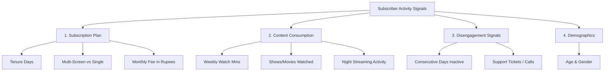

# 🎬 StreamPulse™ — OTT Subscriber Churn & Retention Platform

[](https://customer-churn-risk-analyzer.streamlit.app/)
[](https://www.python.org/)
[](https://opensource.org/licenses/MIT)
[-orange.svg)](https://scikit-learn.org/)
[](https://customer-churn-risk-analyzer.streamlit.app/)

> **An executive-ready, machine-learning-powered revenue intelligence platform designed specifically for Over-The-Top (OTT) media streaming platforms (Netflix, Prime Video, Disney+ Hotstar, Zee5, JioCinema).**

🌐 **Live Application**: [customer-churn-risk-analyzer.streamlit.app](https://customer-churn-risk-analyzer.streamlit.app/)

---

## 📌 Table of Contents
- [Business Overview](#-business-overview)
- [Key Features](#-key-features)
- [Machine Learning Architecture](#-machine-learning-architecture)
- [Streaming Behavioral Signals](#-streaming-behavioral-signals)
- [Interactive Archetypes (Presets)](#-interactive-archetypes-presets)
- [Dual Reporting Suite](#-dual-reporting-suite)
- [Tech Stack](#-tech-stack)
- [Project Structure](#-project-structure)
- [Local Installation & Setup](#-local-installation--setup)
- [Model Training & Calibration](#-model-training--calibration)
- [License](#-license)

---

## 💡 Business Overview

In the streaming industry, **Customer Acquisition Cost (CAC)** continues to soar while user retention is fragile. Subscribers frequently cancel after binge-watching a single season or experiencing playback friction.

**StreamPulse™** addresses this challenge by providing Customer Success, Product, and Retention teams with a predictive intelligence dashboard that:
1. **Identifies Flight-Risk Subscribers Early**: Quantifies exact cancellation likelihood before churn occurs.
2. **Diagnoses Root Causes**: Uncovers behavioral drop-offs (e.g. app dormancy, unresolved buffering complaints, single-screen isolation).
3. **Prescribes Targeted Retention Playbooks**: Recommends personalized incentives (goodwill credits, multi-screen upgrades, content drops) with simulated churn-reduction impact.
4. **Calculates Financial Impact**: Tracks Annual Revenue at Risk (ARR) in **Indian Rupees (₹)** based on subscription tiers.

---

## ✨ Key Features

- **Intuitive Side-by-Side Dashboard**: Clean visual hierarchy where subscriber inputs on the left update live risk scores and recommendations on the right.
- **Theme-Adaptive High-Contrast UI**: Modern slate-and-sky-blue design system that looks crisp and legible in both **Dark Mode** and **Light Mode**.
- **Zero "AI Gimmicks"**: No distracting neon gradients, chatbot bubbles, or pseudo-futuristic tropes—designed like real enterprise software (Stripe, Datadog, Linear).
- **Rupee (₹) Pricing Calibration**: Configured with realistic Indian OTT subscription tiers (₹199 Mobile, ₹499 Standard, ₹649 Premium 4K).
- **One-Click Quick Archetypes**: Instantly test high-risk, loyal, and casual subscriber profiles with a single click.
- **Exportable Retention Dossiers**: Download structured Excel-friendly CSVs or printable executive HTML reports ready for PDF conversion (`Ctrl + P`).

---

## 🧠 Machine Learning Architecture

The predictive engine is trained on the verified [Kaggle OTT Churn Modeling Dataset](https://www.kaggle.com/datasets/santhoshvr97/ott-chrun-modeling-ott) containing 2,000 real-world streaming records.

### Model Performance
- **Algorithm**: `RandomForestClassifier` (150 estimators, max depth 10, stratified validation)
- **Accuracy**: **92.88%**
- **ROC-AUC Score**: **0.8893**
- **Class 0 F1-Score**: **0.96**
- **Class 1 F1-Score**: **0.71**

### Feature Importance Attribution
| Feature Name | Description | Importance |
| :--- | :--- | :--- |
| `customer_support_calls` | Number of complaints logged (buffering/playback friction) | **16.2%** |
| `daily_avg_mins` | Average minutes streamed per day (derived metric) | **11.3%** |
| `maximum_daily_mins` | Maximum minutes watched on peak binge days | **11.3%** |
| `weekly_mins_watched` | Total weekly content consumption | **10.4%** |
| `mins_per_video` | Average viewing session duration per title | **7.7%** |
| `multi_screen` | Single screen vs. household multi-device access | **7.1%** |
| `no_of_days_subscribed` | Total account age with platform | **6.8%** |
| `maximum_days_inactive` | Consecutive dormancy days without streaming | **4.8%** |

---

## 📊 Streaming Behavioral Signals

The platform continuously evaluates four core pillars of user behavior:



---

## 🎯 Interactive Archetypes (Presets)

Users can instantly load representative subscriber profiles using the top preset buttons:

* 🚨 **Binge Dropout (High Churn Risk ~86%)**:
  * *Profile*: 35 days subscribed, 12 consecutive inactive days, 5 unresolved customer support tickets, declining watch time.
  * *Intervention*: Immediate support concierge outreach + ₹150 goodwill credit.
* 🍿 **Loyal Viewer (Low Risk / Safe ~3-5%)**:
  * *Profile*: 380 days subscribed, multi-screen family tier (₹649/mo), steady weekly binge-watching, 1 support inquiry.
  * *Intervention*: Standard VIP previews and loyalty rewards track.
* 📱 **Casual Viewer (Moderate Risk ~25-35%)**:
  * *Profile*: 90 days subscribed, single screen, 6 days inactive, 3 support calls.
  * *Intervention*: Personalized new-release recommendations + multi-screen trial.

---

## 📑 Dual Reporting Suite

When exporting an assessment, StreamPulse™ offers two professional formats:

### 1. 📑 Structured Excel Report (`.csv`)
Unlike raw single-line CSV dumps that get clipped in Excel, this report is structured into clean, readable sections:
- **Section 1: Executive Subscriber Risk Summary** (Risk probability, monthly fee, ARR, account age).
- **Section 2: Streaming Behavior & Engagement** (Weekly mins, shows watched, dormancy days, support tickets).
- **Section 3: Key Risk Drivers** (Adverse vs favorable behavioral signals).
- **Section 4: Recommended Retention Playbook** (Action items and estimated churn delta).

### 2. 📊 Printable Executive Dossier (`.html`)
- An executive-grade visual report styled with KPI tiles, colored risk badges, and clean tabular data.
- Opens in any web browser and is pre-formatted for printing or saving to **PDF (`Ctrl + P`)**.

---

## 🛠️ Tech Stack

- **Frontend & App Framework**: [Streamlit](https://streamlit.io/) (Custom CSS Injection for high-contrast dark/light mode compatibility)
- **Machine Learning**: [scikit-learn](https://scikit-learn.org/) (Random Forest, StandardScaler, StratifiedKFold)
- **Data Manipulation**: [Pandas](https://pandas.pydata.org/), [NumPy](https://numpy.org/)
- **Model Serialization**: [Joblib](https://joblib.readthedocs.io/)
- **Styling**: Vanilla CSS3, Google Fonts (`Plus Jakarta Sans`, `Inter`)
- **Deployment**: Streamlit Community Cloud

---

## 📂 Project Structure

```text
├── .streamlit/
│   └── config.toml               # Streamlit theme configuration (dark mode styling)
├── app.py                        # Main Streamlit web application
├── train_ott_model.py            # Model training & serialization pipeline
├── ott_churn_model_dataset.csv   # Kaggle OTT Churn Modeling Dataset (2,000 records)
├── ott_rf_model.pkl              # Serialized Random Forest model artifact
├── ott_scaler.pkl                # Fitted StandardScaler artifact
├── ott_columns.pkl               # Model feature schema artifact
├── requirements.txt              # Project dependencies for local & cloud deployment
└── README.md                     # Project documentation
```

---

## 🚀 Local Installation & Setup

### 1. Clone the Repository
```bash
git clone https://github.com/Aaqib-Proj/Customer-Churn-Predictor.git
cd Customer-Churn-Predictor
```

### 2. Create and Activate a Virtual Environment
```bash
# Windows
python -m venv venv
.\venv\Scripts\activate

# macOS / Linux
python3 -m venv venv
source venv/bin/activate
```

### 3. Install Dependencies
```bash
pip install -r requirements.txt
```

### 4. Run the Application
```bash
streamlit run app.py
```
The app will automatically launch in your default browser at `http://localhost:8501`.

---

## 🔄 Model Training & Calibration

To retrain the model on updated or custom subscriber data:

```bash
python train_ott_model.py
```
This script will:
1. Load and clean `ott_churn_model_dataset.csv`.
2. Engineer interaction ratios (`daily_avg_mins`, `mins_per_video`).
3. Train the calibrated Random Forest Classifier.
4. Print classification metrics and ROC-AUC scores.
5. Save updated artifacts (`ott_rf_model.pkl`, `ott_scaler.pkl`, `ott_columns.pkl`).

---

## 📜 License

This project is licensed under the **MIT License** — see the [LICENSE](LICENSE) file for details.
